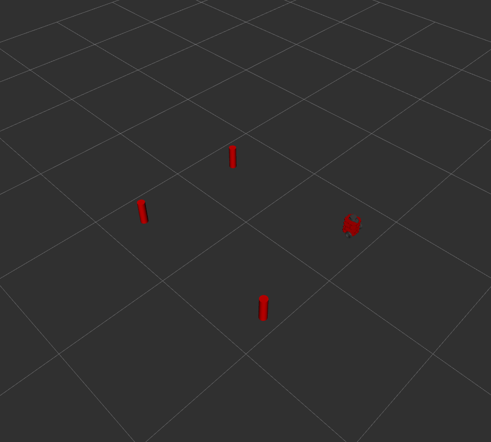

# NUSIM
**Author: Marshall Johnson**  

This package can be used as a simulator and visualizer.

# Launchfiles

 - nusim.launch: This file starts the nusimulator. Running this launchfile using the command `roslaunch nusim nusim.launch` will start rviz, the nusim node, and load all parameters necessary for the simulation. When launched, the robot, obstacles and world frame are visible by default. 

 # Parameters
Below is a list of parameters that can be modified by the user to change the simulator settings:

 - radius: radius of cylindrical obstacles
 - height: height of cylindrical obstacles
 - obs_x: x-coordinates of the obstacles
 - obs_y: y-coordinates of the obstacles
 - x0: starting x position of the robot
 - y0: starting y position of the robot
 - theta0: starting orientation of the robot

 # Rviz Demonstration
 

