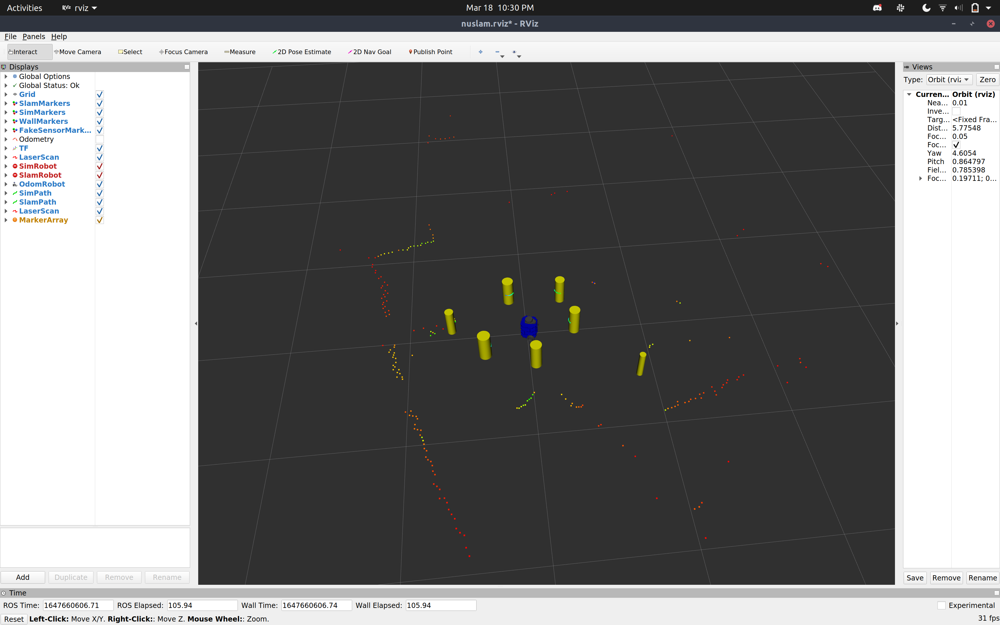

# THE NUSLAM PACKAGE
**Author: Marshall Johnson**  

This package implements the extended Kalman Filter SLAM algorithm in simulated and real environments.

# Nodes
- landmarks: detect landmarks and publish their relative locations
- slam: implementation of SLAM functionality

# Setup Instructions
1. Execute `roslaunch nuslam landmark_detect.launch` to launch the simulator.
    - This will launch three simulated robots: one purely for simulation, one for odometry and one for SLAM.
    - Additionally, marker arrays will appear showing the location of markers based on a variety of data sources.
2. To run on a real turtlebot, add the argument `robot:=[turtlebotname]` to the command above
3. The argument `rviz:=false` will turn off the Rviz visualization
4. Finally, you can control the movement command source using the argument `cmd_src:=teleop` for keyboard control
        and `cmd_src:=circle` for control using the service `control`

# Landmark Detection Algorithm

The `landmarks` node takes 2D laser scan data and outputs landmark locations relative to a robot. To do this,
the following steps were implemented:  
- Clustering
- Circle fitting
- Classification

**Clustering:** To cluster laser scan points, a distance threshold of 0.1 m was used. Consecutive data points
that fell within this threshold were included in the same cluster, whereas a point that fell outside this 
range was added to a new cluster. Any clusters with less than three points were discarded. 

**Circle fitting:** To detect the circles, a fitting algorithm was employed. The algorithm can be found here: 
https://nu-msr.github.io/navigation_site/lectures/circle_fit.html  

**Classification:** To avoid false positives, clusters were classified into two groups: circle or not circle. 
The algorithm used was take from J. Xavier et. al., Fast line, arc/circle and leg detection from laser scan data in a Player driver, ICRA 2005. The angle between endpoints of the cluster and each point in between was used to determine whether
or not the cluster was a circle. If the angle was the same for every point, the cluster was labeled a circle.

# Data Association Algorithm

This package attempts to employ a data association algorithm based on Euclidean distance to landmarks. For every 
landmark discovered, a list of already known obstacles is referenced and the newly discovered landmark is 
classified as new or existing; if the landmark matches a previously known landmark (based on x, y coordinates 
derived from Euclidean distance), then the landmark is ignored, as it is already present in the known state. Otherwise, 
the landmark initialized into the SLAM algorithm and added to the list of known landmarks. In its current state, this 
algorithm is not properly tuned, so the SLAM algorithm is unable to run on unknonwn data. That said, the SLAM algorithm 
is functional when presented with fake sensor data.

 # Landmark Detection Demonstration
 

 

 